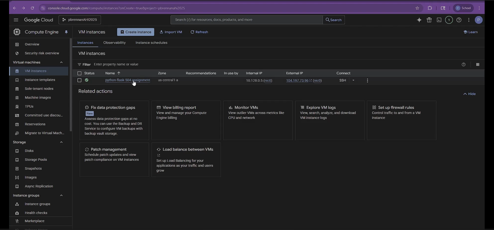
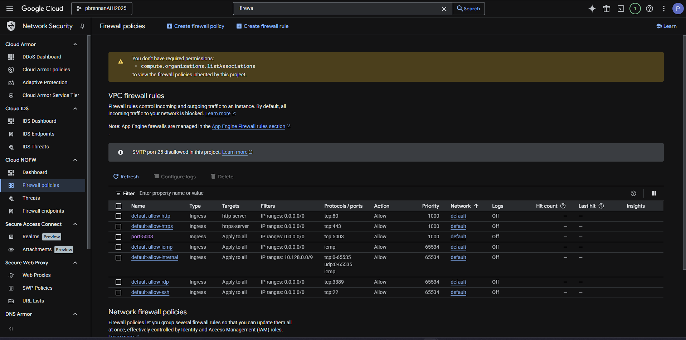
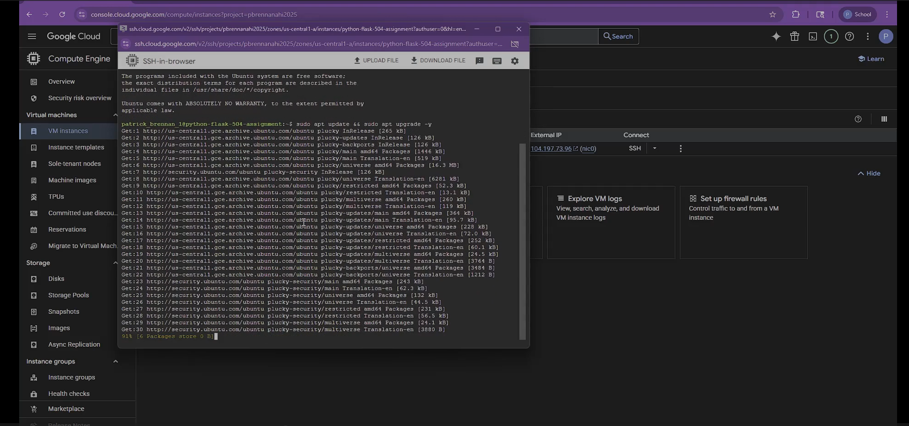
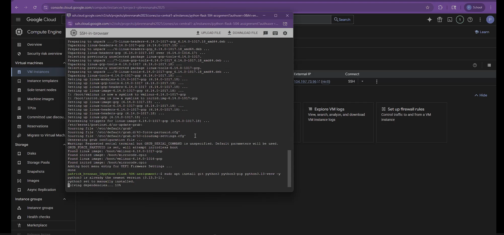
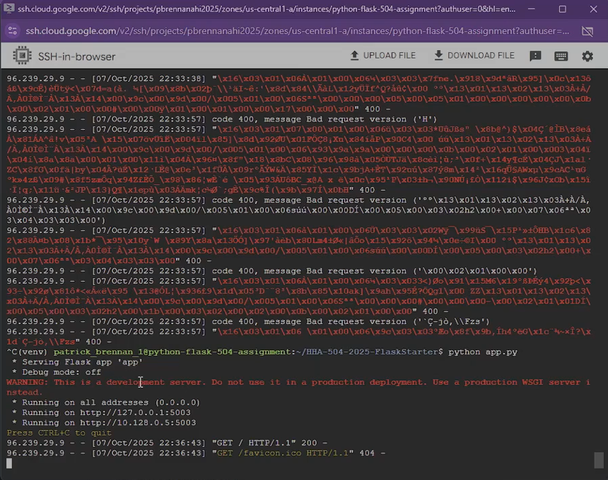
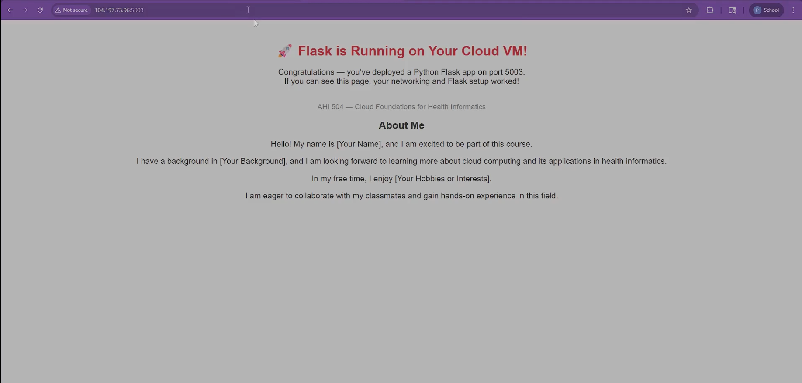

# Flask on Cloud VM (Assignment 2)

## Student Info
- Name: Patrick Brennan
- Cloud Provider: Google Cloud

## Video recording: 
- Youtube Video: https://youtu.be/FnMbZX9vJjA

## Steps
### 1. VM Creation

### 2. Networking (Port 5003 Open)

### 3. OS Update + Python Install

### 4. Flask App Running

### 5. Public IP Access
URL: http://104.197.73.96:5003  
